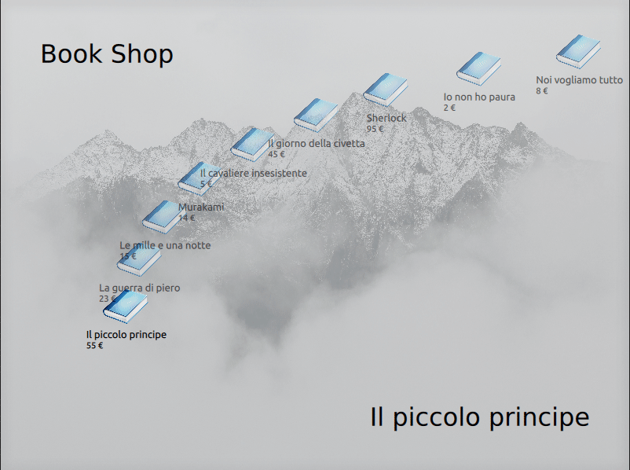

## Burger Shop App [in development]

Just for fun !

- SQLite
- C++/17
- Qt6
- QML
- Cmake

# Build and run
please source the environment and run: 
> cmake . ; make; ./burger-shop

export WAYLAND_DISPLAY=wayland-1
export XDG_RUNTIME_DIR=/run/user/1000
export QT_QPA_PLATFORM=wayland
LD_LIBRARY_PATH=$LD_LIBRARY_PATH:./cart:./shop:./KoDInput:./burger:./dbhelper:./sqlite ./burger-shop